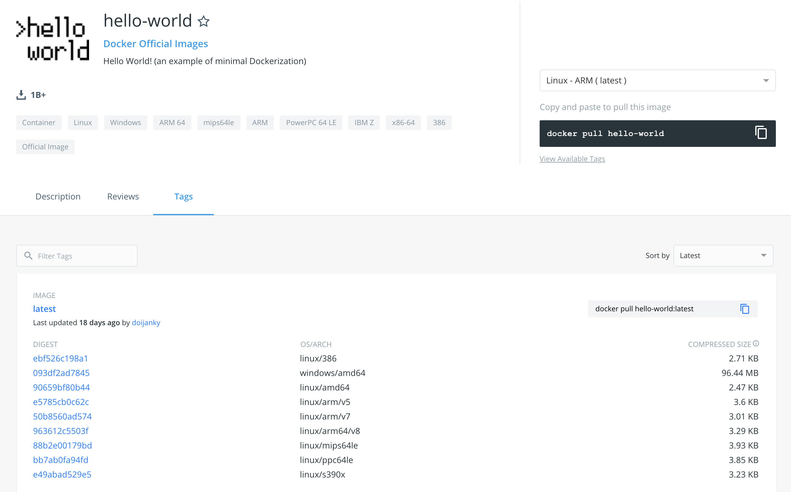
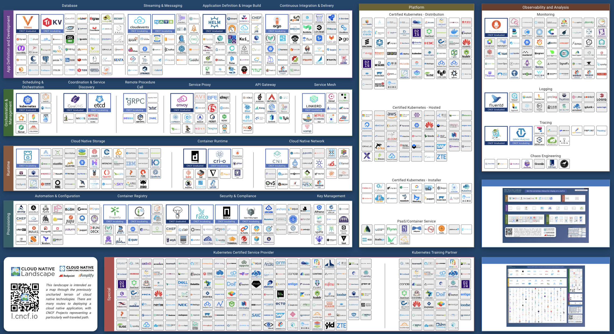
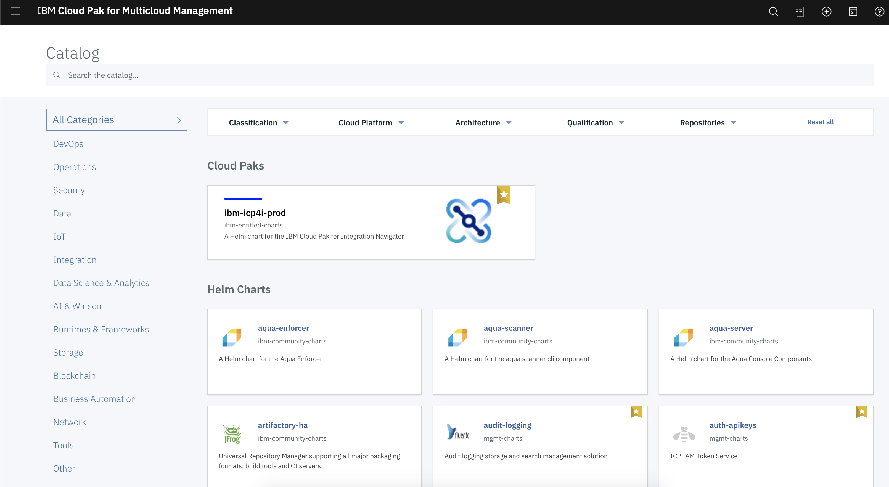
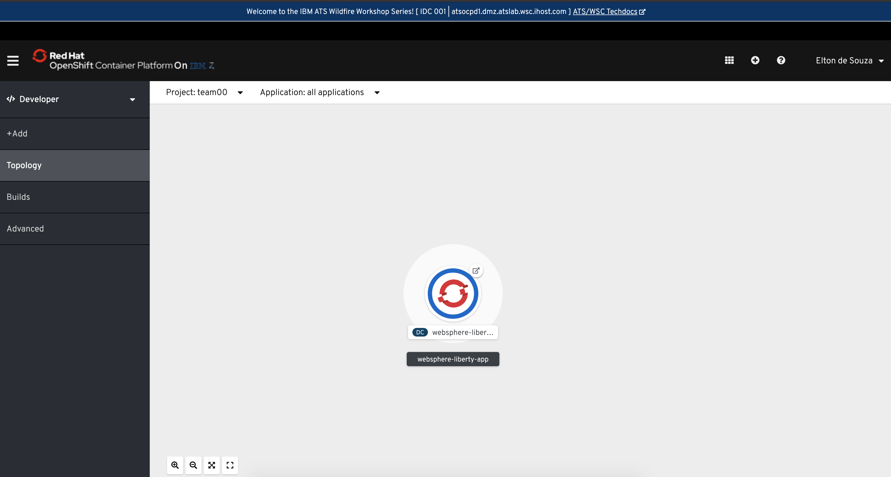

# Multi-architecture devOps using OpenShift

## WE ARE MODIFYING THIS TO USE THE JENKINS PLUGINS WITH BUILD CONFIGS ETC FOR OCP 4.X. THE MECHANISM BELOW IS STILL VALID AS A LEARNING TOOL.

In this lab you will learn how to deploy a Jenkins pipeline to build your source code from github and deploy it to both OpenShift on Intel and OpenShift on IBM Z/LinuxONE. While there are several other steps in a devOps process, we will only focus on the deployment aspect here.

- [Multi-architecture devOps using OpenShift](#multi-architecture-devops-using-openshift)
  - [ID Prerequisites](#id-prerequisites)
  - [Environment](#environment)
  - [Topology Diagram](#topology-diagram)
      - [LinuxONE Community Cloud](#linuxone-community-cloud)
  - [What is a multi-architecture deployment anyway?](#what-is-a-multi-architecture-deployment-anyway)
    - [Dockerfile](#dockerfile)
    - [Multi-architecture Manifests](#multi-architecture-manifests)
    - [Building multi-arch images](#building-multi-arch-images)
    - [Combining multi-arch images and manifests](#combining-multi-arch-images-and-manifests)
  - [Container Registries](#container-registries)
  - [DevOps ecosystem](#devops-ecosystem)
    - [Jenkins](#jenkins)
      - [Nodes](#nodes)
  - [Application](#application)
  - [Putting it all together](#putting-it-all-together)
  - [Tips for multi-architecture builds:](#tips-for-multi-architecture-builds)
  - [IBM Multicloud Manager](#ibm-multicloud-manager)

---

> Note, this is a generated PDF document, the latest version of this lab is on [github](https://github.com/THINKLab2020/multi-arch-devops)

## ID Prerequisites

- [GitHub](https://github.com/join)
- [Docker](https://hub.docker.com/signup) and [Docker Access Token](https://hub.docker.com/settings/security)
- [IBM Cloud](https://cloud.ibm.com/registration)
- IBM Washington System Center (will be distributed as part of the lab)
- [LinuxONE Community Cloud](https://linuxone.cloud.marist.edu/cloud/#/register?flag=vm) (optional, but useful for self paced lab)

## Environment

- RedHat OpenShift (ROKS) on IBM Cloud
- RedHat OpenShift on IBM LinuxONE (in IBM Washington System Center)
- Jenkins (in IBM Washington System Center)
- IBM Container Registry on IBM Cloud
- Jenkins agent on [IBM LinuxONE Community Cloud](https://developer.ibm.com/linuxone/)

<div style="page-break-after: always;"></div>

## Topology Diagram


> **Note:** Using the Kubernetes Jenkins plugin or OCP native Jenkins or other cloud native devOps pipeline tooling would enable even fewer moving parts.

You can run the Jenkins master itself on one of the clusters and the agent in another OCP cluster, reducing the need for 2 separate VMs. It will be much easier to manage/scale and Jenkins kubernetes plugin can even create ephemeral agents just to build and then destroy if needed. As you will note in the [Jenkins](#jenkins) section below, the goal of this lab is to go through each step as a learning exercise and to stay away from opinionated CI/CD tooling.

<!--div style="page-break-after: always;"></div-->

#### LinuxONE Community Cloud

The LinuxONE Community Cloud is a no-charge environment for experiencing Linux on the IBM LinuxONE platform. Linux could be any of your favorite disto's like RedHat Enterprise Linux, SUSE or Ubuntu. It can be used to test drive your Open Source project on the s390x architecture and optimize for over 200+ hardware instructions specifically added to speed up modern languages like Java, Go etc.

<!--div style="page-break-after: always;"></div-->

## What is a multi-architecture deployment anyway?

A multi-architecture deployment is a deployment that lets you consume the same image (e.g hello-world:latest) on any platform using the same deployment artifacts (pod definitions, deployments, services, routes etc). This greatly simplifies the deployment process while letting an organization optimize for metrics like:

- Cost
- Throughput
- Latency
- Security and Compliance
- Scalability
- Resiliency and reliability
- Uptime

Platforms include:

- Operating System (windows, linux etc)
- Instruction Architecture (**amd64**, **s390x**, ppcle64, arm, arm64 etc)

### Dockerfile

Writing a simple Dockerfile is easy, but we thought including some best practices here will help, esp since it will help speed up the multi-arch build process.

### Multi-architecture Manifests


To enable multi-architecture, docker added support for manifests which let you link which platform to image (but exposing the end result as the same image). e.g "docker run hello-world" will first look at the version (`latest` is implied if no version tag is specified) then will check the local operating system and architecture (e.g linux, s390x) and query that combination in the registry. Once it fins that combination, it'll pull _only that specific container_ locally. Multi-arch images are similar to "fat binaries" at the container registry level but single, os and architecture specific images at the docker daemon level.

By default the Docker daemon will look at its current operating system and architecture but it is possible to force download of a specific platform/architecture using the `--platform` command which is available in docker API [1.32+](https://docs.docker.com/engine/api/v1.32/) and need `experimental features` turned on in Docker daemon. The full specification of multi-architecture manifests can be found [here](https://docs.docker.com/registry/spec/manifest-v2-2/). More information on `docker pull` be found in the official docs [here](https://docs.docker.com/engine/reference/commandline/pull/).

Manifests support the following combinations:
* arch (mostly Go arch names like `amd64`, `s390x` etc)
* os (`linux`, `windows` etc)
* os-version (mostly used for `windows`)
* variant (only used for `arm`)
* os-feature (mostly for `windows`)

> All these instructions are valid for `podman` and `buildah`. Just replace `docker` with `buildah` for manifest commands.

<div style="page-break-after: always;"></div>

### Building multi-arch images

Images are just binaries and as such, require to be built on the appropriate platform (build architecture = destination architecture). There are 2 ways of building multi-arch images:

- docker [buildx](https://mirailabs.io/blog/multiarch-docker-with-buildx/) builder
- docker default builder

The buildx builder is the most convenient mechanism but can be very slow for non-native architectures as it is emulating the target architectures ISA in qemu. Docker's default builder is the most popular and is used in production by almost every organization building multi-arch images, but needs to run on the destination architecture while building.

### Combining multi-arch images and manifests

The first step is to build the containers on each architecture and store then in a single location. You could push them separately once the manifest is pushed to the repo.

We build these images each on Docker running on the appropriate architecture. Then these specific tags as it'll make mapping architectures to containers easier. The `docker save` and `docker load` command can be used to push these to a single location. They can also be pushed separately, but they

```
thinklab/go-hello-world:amd64-latest
thinklab/go-hello-world:arm32-latest
thinklab/go-hello-world:s390x-latest
```

> **Note, you must push the containers to your container registry _before_ creating a manifest. Having them in your local registry isn't enough**

Next, we create a manifest which contains each of these images:

```bash
docker manifest create thinklab/go-hello-world:latest \
thinklab/go-hello-world:amd64-latest \
thinklab/go-hello-world:arm32-latest \
thinklab/go-hello-world:s390x-latest
```

Now let's review the output of:

```bash
docker manifest inspect thinklab/go-hello-world:latest
```

```json
{
  "schemaVersion": 2,
  "mediaType": "application/vnd.docker.distribution.manifest.list.v2+json",
  "manifests": [
    {
      "mediaType": "application/vnd.docker.distribution.manifest.v2+json",
      "size": 3254,
      "digest": "sha256:....",
      "platform": {
        "architecture": "s390x",
        "os": "linux"
      }
    },
    {
      "mediaType": "application/vnd.docker.distribution.manifest.v2+json",
      "size": 3038,
      "digest": "sha256:....",
      "platform": {
        "architecture": "arm",
        "os": "linux"
      }
    },
    {
      "mediaType": "application/vnd.docker.distribution.manifest.v2+json",
      "size": 2824,
      "digest": "sha256:....",
      "platform": {
        "architecture": "amd64",
        "os": "linux"
      }
    }
  ]
}
```

The manifest command automatically picked up and annotated the architecture and operating system for each image.

You could also manually annotate with:

```bash
docker manifest annotate thinklab/go-hello-world:latest \
thinklab/go-hello-world:s390x-latest --arch s390x --os linux
```

If we want to update the images referenced in the manifest, we could rebuild and tag appropriately, then run:

```bash
docker manifest create thinklab/go-hello-world:latest \
--amend thinklab/go-hello-world:amd64-latest \
```

```
docker manifest push thinklab/go-hello-world:latest
```

Now you can do a docker pull on either Intel, ARM or IBM Z (s390x) and it will automatically pull the right container. This also applies to Kubernetes since internally, a pod just pulls the container following OCI spec.

```bash
docker pull thinklab/go-hello-world
```

This is just a small sample of platform options. If you look at the `hello-world` container, you'll several 9 different combinations of architecture and platform.



## Container Registries

When doing multi-arch, not all container registries are created equal. There are a few factors that might be important to help make a selection.

| Name                         | Supports multi-architecture manifests | Certified for LinuxONE | Independent Product |
| ---------------------------- | :-----------------------------------: | :--------------------: | :-----------------: |
| OpenShift Container Registry |                  ✅                   |           ✅           |                     |
| Quay                         |                  ✅                   |                        |         ✅          |
| Docker Trusted Registry      |                  ✅                   |           ✅           |                     |
| jFrog Artifactory            |                  ✅                   |                        |         ✅          |
| Gitlab                       |                  ✅                   |                        |         ✅          |

_Supports multi-architecture manifests:_ Not all registries support multi-arch manifests, the ones in the list do as they are relatively mature projects, but there are several in the wild that do not.

_Certified for LinuxONE:_ A registry might be able to store images tagged for the `s390x` architecture but the registry itself might not run on a LinuxONE server. This is important as several organizations prefer to run their mission critical workloads and databases on LinuxONE and since a container registry stores images used in production, LinuxONE support is favorable.

_Independent Product:_ A registry might come bundled with a larger set of products. Independent Product implies it can run on its own, without an overarching product.

## DevOps ecosystem

This is a map of the CNCF ecosystem around containers:


Drill down to the build and delivery section:


As there are many options, each doing things in its own opinionated way, we will use Jenkins for this lab which will give you a foundation to build upon and consume the other tools.

<!--div style="page-break-after: always;"></div-->

### Jenkins


We will not cover Jenkins setup as it is a "household name" in the world of modern delivery pipelines. More information can be found at Jenkins [official](https://www.jenkins.io/)

_Useful plugins to install:_

- SSH
- Kubernetes
- OpenShift Jenkins Pipeline
- OpenShift Login

> **Note:** While using Jenkins plugins will make this _much_ easier, we will do _**deployments the hard way**_ as a learning exercise in this lab. We will just be using Jenkins as a glorified remote bash scripts runner, so every step is clear.

Other tools such as Tekton, JenkinsX, Razee etc make this much easier as they were built for kubernetes CI/CD. Cloud providers offer their own build tooling and now even GitHub offers native CI/CD with GitHub Actions. You will most likely use these other tools in production environments.

#### Nodes

If you don't specify a node, Jenkins will run the stage on any node. If you only use one architecture the default behavior might be ok but for multi-arch builds, you need to build on the deployment architecture if you use the native docker builder (`docker build`). Note, the `s390x` here is a label you must explicitly give your Jenkins nodes. You can call the node what ever you want but having the architecture in its name will help for this lab. _Jenkins has no innate architectural recognition capability._

```groovy
node ('s390x') {
    stage('Source') {
        // Get some code from our Git repository
        git 'https://github.com/IBM/node-s2i-openshift.git'
    }
    stage('Build') {
        // Build the container
        docker build -t node .
    }
    ..
}
```

Mixed node pipelines are also possible:

```groovy
node ('s390x') {
    ..
}
node {
    ..
}
node ('prod') {
    ..
}
```

Here, the stages in the middle `node {}` can run on any node, the stages on the `node ('prod')` will run on any nodes with prod label and of course, `node ('s390x')` will run on our node labeled s390x for this lab.

This is a sample of the Jenksfile we will use in this lab to build images that can run on IBM LinuxONE:

```groovy
pipeline {
    agent {
        label 's390x'
    }
    environment {
        user_creds = credentials('dockerhub') // dockerhub is user/pass credential stored as Jenkins cred. Token can be used too
        image = 'thinklab/go-hello-world:s390x-latest' // Replace with your [dockerid]/go-hello-world:s390x-latest
        registry = 'https://github.com/THINKLab2020/go-hello-world.git' // Replace with your fork of the hello-world code
    }
    stages {
        stage('Pull Source') {
            steps {
                sh 'rm -rf go-hello-world'
                sh 'git clone $registry'
            }
        }
        stage('Build image') {
            steps {
                dir('go-hello-world') {
                    sh 'sudo -n docker build . -t go-hello-world'
                }
            }
        }
        stage('Tagging image') {
            steps {
                sh 'sudo -n docker tag go-hello-world $image'
            }
        }
        stage('Pushing image') {
            steps {
                sh 'sudo -n docker login -u $user_creds_USR -p $user_creds_PSW'
                sh 'sudo -n docker push $image'
            }
        }
        stage('Amending manifest') {
            steps {
                sh 'sudo -n docker login -u $user_creds_USR -p $user_creds_PSW'
                sh 'export DOCKER_CLI_EXPERIMENTAL=enabled ; sudo -E -n docker manifest create thinklab/go-hello-world:latest --amend thinklab/go-hello-world:amd64-latest --amend thinklab/go-hello-world:s390x-latest'
                sh 'export DOCKER_CLI_EXPERIMENTAL=enabled ; sudo -E -n docker manifest push thinklab/go-hello-world:latest'

            }
        }
        stage('Deploy Image to OpenShift') {
            agent { label 'master' }
            steps {
                sh 'oc login --token=[replace] --server=[replace]'
                sh 'oc delete is/go-hello-world || true' // Delete existing stream
                sh 'oc delete thinklab go-hello-world || true' // & deployment config
                sh 'oc new-app thinklab/go-hello-world' // Push new stream
            }
        }
    }
}

```

> Note, there are much more elegant ways of updating images in OpenShift once built. Here, we're using a very simplistic approach. Also, needing `root` to deploy or list containers doesn't makes sense - that's why we use `podman` over docker in our day to day projects.

## Application

We will be using a simple hello-world Go web-server, that provides some interactivity in terms of its output across code changes. We will be using a [Go app](https://github.com/e-desouza/go-hello-world) that prints `Hello, World!` on http://localhost:8080 . This will also be a good test for Routing in OpenShift. The simplest way to deploy an app to OpenShift if you have a container in a cluster accessible repo, is to use `oc new-app [container name]`

So in our lab, it will be:

`oc new-app thinklab/go-hello-world`

You should see an output similar to this:

```bash
--> Found container image 90bd6b5 (32 minutes old) from Docker Hub for "thinklab/go-hello-world"

    * An image stream tag will be created as "go-hello-world:latest" that will track this image
    * This image will be deployed in deployment config "go-hello-world"
    * The image does not expose any ports - if you want to load balance or send traffic to this component
      you will need to create a service with 'oc expose dc/go-hello-world --port=[port]' later

--> Creating resources ...
    imagestreamtag.image.openshift.io "go-hello-world:latest" created
    deploymentconfig.apps.openshift.io "go-hello-world" created
--> Success
    Run 'oc status' to view your app.
```

`oc status` will show:

```
In project team00 on server https://api.atsocpd1.dmz:6443

http://go-hello-world-team00.apps.atsocpd1.dmz to pod port 8080-tcp (svc/go-hello-world)
...
```

Next, to map it to localhost, you could:
`oc get pods`

```
NAME                              READY   STATUS      RESTARTS   AGE
go-hello-world-84s76            1/1     Running     0          55s
..
```

and then

```
kubectl port-forward go-hello-world-84s76 8090:8080
```

Then either moving this to the background or opening a new session,

`curl localhost:8080`

which will show:

```bash
Hello, World!
```

## Putting it all together

Putting the build and deploy steps together:

1. Fork the code into your GitHub repo
2. Modify the Jenkinsfile and replace _["GIT REPO HERE"]_ to use your repo
3. Copy the contents of the Jenkinsfile to your Jenkins job
4. Run the job
5. See your output at https://ip:port for your ROCKS cluster and https://ip:port for your OCP on Z cluster (links to both will be shown as part of the job)
6. clone the repo you forked in step 1.
7. Change the `Hello World` on Line 14 in the code to anything you prefer and commit and push your code to github

```go
func HelloServer(w http.ResponseWriter, r *http.Request) {
	fmt.Fprintf(w, "Hello, World!") ← Modify this
}
```

8. Watch the Jenkins dashboard for activity and follow the links at end to get connectivity information to your code

As this job uses Github hooks, it'll automatically build after step 7.

> Note, how our [Jenkinsfile](./code/Jenkinsfile) has a mix of `node ('s390x')` and `node ('amd64')`.

## Tips for multi-architecture builds:

- Use multi-architecture base images. The official images on RedHat Container Registry and dockerhub of popular run-times are multi-arch enabled, signed and supported by their vendors (e.g IBM for the popular WebSphere Liberty runtime)
- Ensure registry lives outside your OpenShift Cluster. This will enable you to deal with cluster operations (scaling/spin-up/spin-down) independent of the registry
- Use multi-stage builds. You will store as many copies of binaries as architectures, so image size can creep up quickly
- Optimize for prod by stripping debug symbols, using UPX etc
- Use native architecture build environments instead of `buildx` for speed
- As a Jenkinsfile is valid Groovy, you can use the same exact Jenkinsfile with a `for loop` to generate build steps for each architecture. This will better align with the DRY (**D**on't **R**epeat **Y**ourself) principle.

```
stage('multi-arch-build') {
    def arch = ["amd64", "s390x", "arm64"]

    for(..) {
      node(arch[i]) {
        ...
      }
    }
    parallel arch
}
```

- You could use Jenkinsfile as YAML and then a YAML templating engine like [ytt](https://get-ytt.io/)(whose output can also be passed into `helm` etc).
- If sticking with Jenkins, use the plugins ecosystem (Kubernetes, OpenShift, Docker)
- If moving to cloud-native CI/CD, use Tekton/JenkinsX/Razee etc
- When doing builds across clusters and especially across firewall and security/compliance operational boundaries (e.g in a hybrid environment), pay special attention to security by using key based auth where possible, rolling certs, checksum validation, running your build system in zero-trust environments like [Hyper Protect Virtual Servers](https://www.ibm.com/cloud/hyper-protect-virtual-servers) etc. The examples we followed today were only for illustration.

> ## **Thats it ! You can now build your multi-architecture deployment pipeline on OpenShift across any public and private cloud environment ! 🎉**

<!--div style="page-break-after: always;"></div-->

---

> Now that you've completed the basic lab, you can learn about tools to do this in production. IBM Multicloud Manager is one such tool that is beyond the scope of the current THINK lab but will included in future self-paced labs.

## IBM Multicloud Manager

The IBM Cloud Pak® for Multicloud Management, running on Red Hat OpenShift Container Platform, provides consistent visibility, governance and automation from on premises to the edge. Enterprises gain capabilities such as multicluster management, event management, application management and infrastructure management. Enterprises can leverage IBM Cloud Pak to help increase operational efficiency that's driven by intelligent data analysis and predictive golden signals, and gain built-in support for their compliance management.

For this lab, using MCM you could add both OCP on Intel and Z clusters, setup a `podPlacementPolicy` and deploy your app to MCM and let MCM decide the best place to deploy it.

```yaml
apiVersion: mcm.ibm.com/v1alpha1
 kind: PlacementPolicy
 metadata:
   name: prod-placement-policy
   namespace: mcm
 spec:
   clusterLabels:
     matchLabels:
       cloud: ibm-linuxone
```

More details on placement policies can be found in the official IBM Multicloud Manager [documentation](https://www.ibm.com/support/knowledgecenter/SSFC4F_1.3.0/mcm/compliance/policy_example.html)

Our MCM cluster is setup with several kubernetes based PaaS clusters.

This shows the summary in a GUI:


Cluster(s) health in a single view:


Cross-cluster catalog:


Details about our specific OCP on Z cluster


Clicking on the endpoint will take you to the OCP on Z Cluster:


In this scenario, I deployed WebSphere Liberty on OpenShift though IBM Multicloud Manager:


<!--div style="page-break-after: always;"></div-->

Similarly, you could go to your ROKS cluster using the IBM Cloud console or through MCM GUI:


Detailed instructions on MCM deployment and management across multiple architectures will be part of our self-paced lab.
