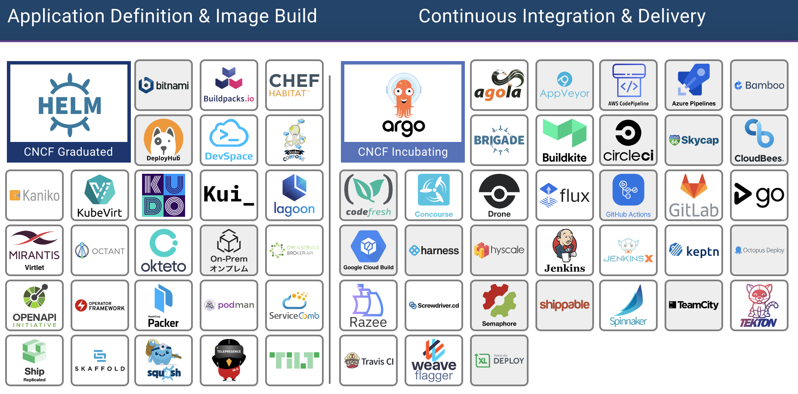
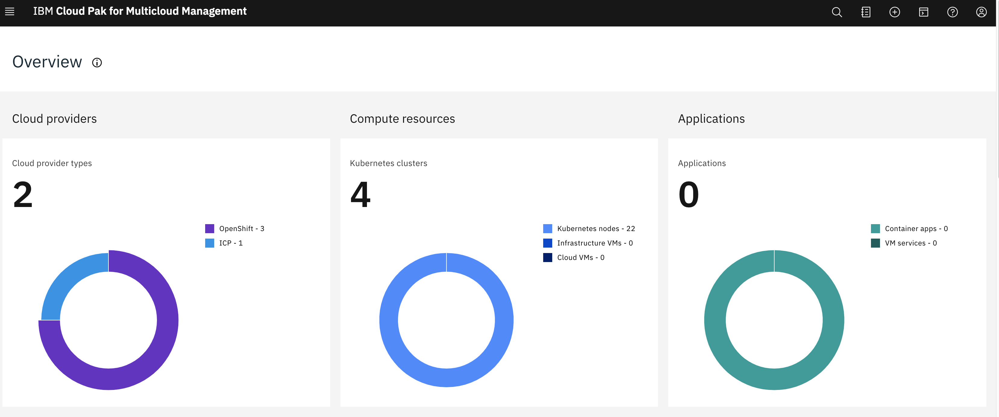

## Multi-architecture devOps using OpenShift

In this lab you will learn how to deploy a Jenkins pipeline to build your source code from github and deploy it to both OpenShift on Intel and OpenShift on IBM Z/LinuxONE.

### Environment:

- RedHat OpenShift (ROKS) on IBM Cloud
- RedHat OpenShift on IBM LinuxONE (in IBM Washington System Center)
- Jenkins (in IBM Washington System Center)
- IBM Container Registry on IBM Cloud
- Jenkins agent on [IBM LinuxONE Community Cloud](https://developer.ibm.com/linuxone/)

## ID Prerequisites:

- [GitHub](https://github.com/join)
- [Docker](https://hub.docker.com/signup)
- [IBM Cloud](https://cloud.ibm.com/registration)
- IBM Washington System Center (will be distributed as part of the lab)
- [LinuxONE Community Cloud](https://linuxone.cloud.marist.edu/cloud/#/register?flag=vm) (optional, but useful for self paced lab)

### What is a multi-architecture deployment anyway?

A multi-architecture deployment is a deployment that lets you consume the same image (e.g hello-world:latest) on any platform using the same deployment artifacts (pod definitions, deployments, services, routes etc). This greatly simplifies the deployment process while letting an organization optimize for metrics like:

- Cost
- Throughput
- Latency
- Security and Compliance
- Scalability
- Resiliency and reliability
- Uptime

Platform includes:

- Operating System (windows, linux etc)
- Instruction Architecture (**amd64**, **s390x**, ppcle64, arm64 etc)

### Multi-architecture Manifests


To enable multi-architecture, docker added support for manifests which let you link which platform to image (but exposing the end result as the same image). e.g "docker run hello-world" will first look at the version (`latest` is implied if no version tag is specified) then will check the local operating system and architecture (e.g linux, s390x) and query that combination in the registry. Once it fins that combination, it'll pull _only that specific container_ locally. Multi-arch images are similar to "fat binaries" at the container registry level but single, os and architecture specific images at the docker daemon level.

By default the Docker daemon will look at its current operating system and architecture but it is possible to force download of a specific platform/architecture using the `--platform` command which is available in docker API [1.32+](https://docs.docker.com/engine/api/v1.32/) amd meed `experimental features` turned on in Docker daemon. The full specification of multi-architecture manifests can be found [here](https://docs.docker.com/registry/spec/manifest-v2-2/). More information on `docker pull` be found in the official docs [here](https://docs.docker.com/engine/reference/commandline/pull/).

### Building multi-arch images:

Images are just binaries and as such, require to be built on the appropriate platform (build architecture = destination architecture). There are 2 ways of building multi-arch images:

- docker [buildx](https://mirailabs.io/blog/multiarch-docker-with-buildx/) builder
- docker default builder

The builx builder is the most convenient mechanism but can be slow for non-native architectures as it is emulating the target architectures ISA in qemu. Docker's default builder is the most popular and is used in production by almost every organization building multi-arch images.

### Container Registries

### DevOps tools:

This is a map of the CNCF ecosystem around containers:


Drill down to the build and delivery section:


In this lab we'll be using Jenkins.

### Jenkins installation:


We will not cover Jenkins setup as it is a "household name" in the world of modern delivery pipelines. More information can be found at Jenkins [official](https://www.jenkins.io/)

_Useful plugins to install:_

- SSH
- Kubernetes
- OpenShift Jenkins Pipeline
- OpenShift Login

> **Note:** While using Jenkins plugins will make this _much_ easier, we will do _**devops the hard way**_ as a learning exercise in this lab.

We will be using Jenkins as a tool that can run `bash` scripts remotely. Other tools such as Tekton, JenkinsX, Razee etc make this much easier as they were built for kubernetes CI/CD. Cloud providers offer their own build tooling and now even GitHub offers native CI/CD with GitHub Actions.

### Topology diagram:

The lab follows this topology:


> **Note:** Using the kubernetes Jenkins plugin or OCP native Jenkins or other cloud native devOps pipline tooling would enable even fewer moving parts

### Application:

We picked a simple app, that provides some interactivity in terms of its output across code changes. We will be using a [Go app](https://github.com/common-nighthawk/go-figure) that prints ASCII art from text.

1. Fork the code
2. Modify the Jenkinsfile and replace _["GIT REPO HERE"]_ to use your repo
3. Copy the contents of the Jenkinsfile to your Jenkins job
4. Run the job
5. See your output at https://ip:port for your ROCKS cluster and https://ip:port for your OCP on Z cluster (links to both will be shown as part of the job
6. clone the repo you forked in step 1.
7. Change the `Hello World` in the code to anything you prefer and commit and push your code to github

```go
  myFigure := figure.NewFigure("Hello World", "", true)
```

8. Watch the Jenkins dashboard for activity and follow the links at end to get connectivity information to your code

As this job uses Github hooks, it'll automatically build after step 7.

### IBM Multicloud Manager

Using MCM you could add both OCP on Intel and Z clusters, setup a `podPlacementPolicy` and deploy your app to MCM and let MCM decide the best place to deploy it.

```yaml
apiVersion: mcm.ibm.com/v1alpha1
 kind: PlacementPolicy
 metadata:
   name: placement1
   namespace: mcm
 spec:
   clusterLabels:
     matchLabels:
       cloud: ibm-linuxone
```

More details on placement policies can be found in the official IBM Multicloud Manager [documentation](https://www.ibm.com/support/knowledgecenter/SSFC4F_1.3.0/mcm/compliance/policy_example.html)

Our MCM cluster is setup with several kubernetes based PaaS clusters.

This shows the summary in a GUI:


Cluster(s) health in a single view:


Cross-cluster catalog:


Details about our specific OCP on Z cluster


Clicking on the endpoint will take you to the OCP on Z Cluster:


